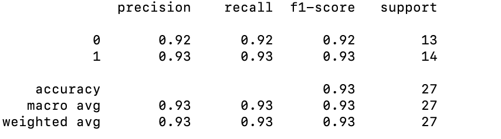

Heart Disease Prediction System

Introduction

The CardioHealth Risk Assessment Dataset provides a comprehensive collection of medical and demographic data, facilitating the development and validation of machine learning models for heart disease prediction. This project aims to leverage various classification algorithms to accurately predict the presence of heart disease based on patient attributes and health indicators.

Dataset Overview
The dataset includes features such as age, sex, chest pain type, blood pressure, cholesterol levels, and lifestyle factors, among others. These attributes serve as inputs for the predictive models, while the target variable, "Heart Disease," indicates the presence or absence of the condition. Datase is from Kaggle(https://www.kaggle.com/datasets/kapoorprakhar/cardio-health-risk-assessment-dataset/data)

Installation
To replicate this project, ensure you have Python installed. Then, install the required dependencies using pip:

pip install -r requirements.txt

Data Preprocessing
The data preprocessing phase involves:

Loading the dataset using pandas.
Separating the target variable and encoding it using LabelEncoder.
Splitting the dataset into training, validation, and test sets.
Standardizing numerical features with StandardScaler.

Model Evaluation

Various classification models are trained and evaluated, including:
Logistic Regression, K-Nearest Neighbors, Support Vector Machine,Decision Tree
Random Forest, Gradient Boosting, AdaBoost, Gaussian Naive Bayes, XGBoost

Evaluation metrics, particularly precision scores, are utilized to assess model performance on the validation set.

Model Performance

The precision scores on the validation set are as follows:

Logistic Regression: 0.76

K-Nearest Neighbors: 0.84

Support Vector Machine: 0.80

Decision Tree: 0.60

Random Forest: 0.76

Gradient Boosting: 0.80

AdaBoost: 0.72

Gaussian Naive Bayes: 0.88

XGBoost: 0.76

Based on the evaluation, Gaussian Naive Bayes demonstrates the highest precision.

Hyperparameter Tuning
Hyperparameter tuning is conducted on the Gaussian Naive Bayes model using GridSearchCV. The optimal hyperparameters are determined, enhancing model performance.

Final Evaluation
The tuned Gaussian Naive Bayes model is evaluated on the test set, yielding an accuracy of 93%. A classification report showcasing precision, recall, and F1-score for each class is generated.

Conclusion
This project showcases the efficacy of machine learning in heart disease prediction. By leveraging patient data and employing advanced algorithms, healthcare professionals can enhance diagnostic accuracy and improve patient outcomes in cardiovascular health

For code details please refer to the [heart_different_models_predict](heart_different_models_predict.py)
