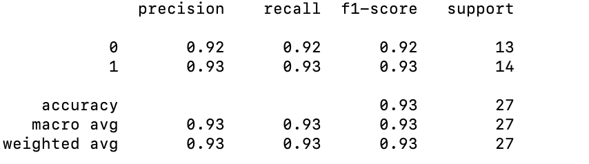

Heart Disease Prediction

Installation
Install the python requirements using pip, preferrably in a virtual environment: pip install -r requirements.txt

This project aims to predict the presence of heart disease based on various features using different machine learning models. The dataset used is the "Heart Disease Prediction" dataset, which contains information about patients' age, sex, chest pain type, blood pressure, cholesterol levels, and other relevant features.

Data Preprocessing

The code starts by importing the necessary libraries and loading the dataset using pandas. The target variable, "Heart Disease," is separated from the features. The target variable is then encoded using LabelEncoder from scikit-learn.
The dataset is split into training, validation, and test sets using the train_test_split function from scikit-learn. The numerical features are standardized using StandardScaler.

Model Evaluation
Several classification models are defined, including Logistic Regression, K-Nearest Neighbors, Support Vector Machine, Decision Tree, Random Forest, Gradient Boosting, AdaBoost, Gaussian Naive Bayes, and XGBoost.
Each model is trained on the training set and evaluated on the validation set using a pipeline that includes the preprocessor and the classifier. The precision score is used as the evaluation metric.
The results of the model evaluation are printed, showing the precision score for each model on the validation set.

Logistic Regression accuracy: 0.76

K-Nearest Neighbors accuracy: 0.84

Support Vector Machine accuracy: 0.80

Decision Tree accuracy: 0.60

Random Forest accuracy: 0.76

Gradient Boosting accuracy: 0.80

AdaBoost accuracy: 0.72

Gaussian Naive Bayes accuracy: 0.88

XGBoost accuracy: 0.76

Hyperparameter Tuning
Based on the above evaluation, the Gaussian Naive Bayes model was found to be the best performer. Hyperparameter tuning is performed on this model using GridSearchCV from scikit-learn. The parameter grid includes different values for the var_smoothing parameter of the Gaussian Naive Bayes model.
The grid search is performed using 5-fold cross-validation, and the best hyperparameters are printed.
{'gaussiannb__var_smoothing': 1e-09}

Final Evaluation
The best Gaussian model from the grid search is evaluated on the test set, and the classification report is printed, showing the precision, recall, and F1-score for each class. Accuracy is 93 percent.

